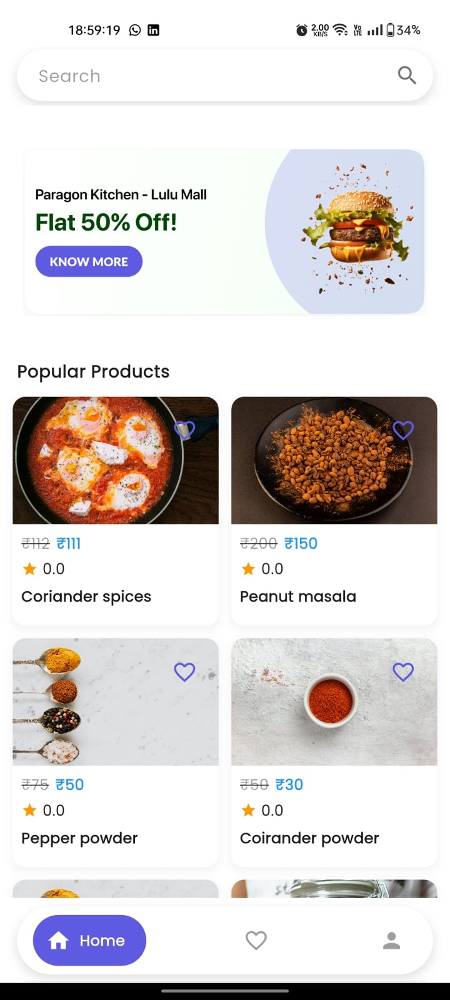
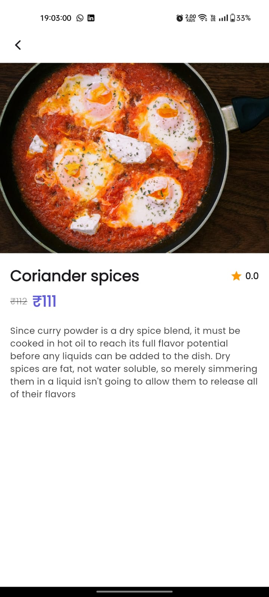

# 🛒 Flutter E-Commerce Skill Test

A Flutter application built as part of the **Skill Test**, showcasing clean architecture, state management with **Bloc**, and integration with REST APIs for products, banners, authentication, and more.

---

## 🚀 Features
- User Authentication (Register, Login, Verify OTP)
- Banner Carousel (from API)
- Product Grid with Wishlist integration
- Search & Categories
- Responsive UI
- State Management with `flutter_bloc`

---

## 📸 Screenshots

  
  
  
  

---

## 🛠️ Tech Stack
- **Framework**: Flutter (3.35.2)
- **State Management**: flutter_bloc
- **Networking**: http
- **UI**: Material Design, Google Nav Bar
- **Architecture**: Feature-based with MVVM

---
